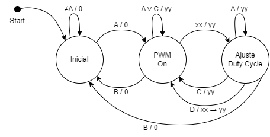
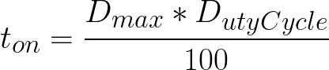
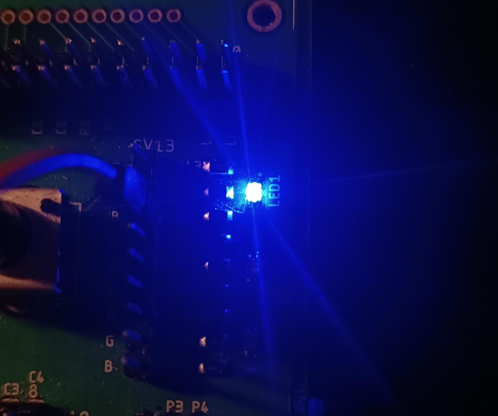

# Proyecto PWM
## Diagrama de estados


***Explicación***: 
En el estado _Inicial_, la máquina está a la espera de ser encendida mediante la tecla **A** y se queda en el mismo estado con cualquier otra entrada. 

Luego, en el estado _PWM on_, el PWM está activo y se puede variar la intensidad del LED ingresando un número con dos cifras que se representa con la entrada **xx**. **A** y **C** no tienen efecto en este estado y si se presionan el duty cycle continúa con el valor guardado **yy**. Con la entrada **B**, se apaga el PWM y vuelve al estado inicial. Y con la entrada del número **xx**, cambia al siguiente estado y provisionalmente la salida sigue en **yy**.

En el estado _Ajuste Duty Cycle_, con la entrada **C** se cancela el cambio de duty cycle y se regresa al estado anterior manteniendo el valor de duty cycle guardado **yy**. Si se presiona en cambio la **D**, el valor de **xx** se convierte en **yy** a partir de ese momento y por ende el duty cycle queda guardado, también regresa al estado anterior que es el de operación normal. En el diagrama este proceso se representa como: (**xx -> yy**). Con la entrada **A** no pasa nada, sigue esperando cancelación o guardado. Finalmente, si en este estado se presiona **B**, se apaga el PWM y vuelve al estado inicial.

## Control de PWM con un LED

Se implementó el ejemplo *"Led Blinky"* del SDK y se modificó para que con un Duty Cycle dado, entregue la señal PWM a un led.

Los cambios se hicieron sobre el archivo *led_blinky.c* sobre la función principal:

```c
int main(void)
{
    /* Board pin init */
    BOARD_InitPins();
    BOARD_InitBootClocks();

    /* Set systick reload value to generate 10 us interrupt */
    if (SysTick_Config(SystemCoreClock / 100000U))
    {
        while (1)
        {
        }
    }

    while (1)
    {
    	int DutyCycle = 1; // De 0 a 99
    	int Dmax = 100U; // Periodo máximo con D = 100%

    	SysTick_DelayTicks((Dmax * DutyCycle) / 100); // Tiempo encendido
        GPIO_PortToggle(BOARD_LED_GPIO, 1u << BOARD_LED_GPIO_PIN);
        SysTick_DelayTicks(Dmax - (Dmax * DutyCycle) / 100); // Tiempo apagado
        GPIO_PortToggle(BOARD_LED_GPIO, 1u << BOARD_LED_GPIO_PIN);
    }
}
```

- **1)** Se cambió la configuración del SysTick para que genere interrupciones cada 10 us en vez de los 1ms del ejemplo. Esto para que se puedan poner frecuencias más altas en los delays.
- **2)** Se crearon las variables *DutyCycle* y *Dmax* de manera provisional para variar los parámetros de la señal PWM.
- **3)** Se implementa el PWM de la siguiente forma: primero un delay con el tiempo de encendido, luego se apaga el led, luego hay otro delay con el tiempo de apagado y luego se enciende el led.
- **4)** Los tiempos de encendido y apagado se calculan de la siguiente forma:




- **Funcionamiento:**


Con Duty Cycle = 1

Con Duty Cycle = 99

## Pines utilizados
En el archivo pin_mux.h del ejemplo del SDK se definen los pines que se van a utilizar para las columnas, las filas y el LED. En este caso se utilizan pines del puerto E:

```c
#define BOARD_INITPINS_LED_RED_GPIO GPIOE 
#define BOARD_INITPINS_LED_RED_PORT PORTE 

//LED
#define BOARD_INITPINS_LED_RED_PIN 2U

//FILAS ---> SALIDAS
#define BOARD_INITPINS_FIL1_PIN 3U
#define BOARD_INITPINS_FIL2_PIN 4U
#define BOARD_INITPINS_FIL3_PIN 5U
#define BOARD_INITPINS_FIL4_PIN 6U

// COLUMNAS --> ENTRADAS
#define BOARD_INITPINS_COL1_PIN 9U
#define BOARD_INITPINS_COL2_PIN 10U
#define BOARD_INITPINS_COL3_PIN 11U
#define BOARD_INITPINS_COL4_PIN 12U
```
## Configuración de pines

En el archivo pin_mux.c se configura el gpio de los pines, incluyendo las resistencias de pullup con el PS y PE:

```c
void BOARD_InitPins(void)
{
    CLOCK_EnableClock(kCLOCK_PortA);
    CLOCK_EnableClock(kCLOCK_PortE);

    gpio_pin_config_t LED_RED_config = {
        .pinDirection = kGPIO_DigitalOutput,
        .outputLogic = 0U
    };

    gpio_pin_config_t Entrada_config = {
         .pinDirection = kGPIO_DigitalInput,
		 .outputLogic = 0U
    };

    // GPIO LED
    GPIO_PinInit(BOARD_INITPINS_LED_RED_GPIO, BOARD_INITPINS_LED_RED_PIN, &LED_RED_config);

    //GPIO Filas ---> Salidas
    GPIO_PinInit(BOARD_INITPINS_LED_RED_GPIO, BOARD_INITPINS_FIL1_PIN, &LED_RED_config);
    GPIO_PinInit(BOARD_INITPINS_LED_RED_GPIO, BOARD_INITPINS_FIL2_PIN, &LED_RED_config);
    GPIO_PinInit(BOARD_INITPINS_LED_RED_GPIO, BOARD_INITPINS_FIL3_PIN, &LED_RED_config);
    GPIO_PinInit(BOARD_INITPINS_LED_RED_GPIO, BOARD_INITPINS_FIL4_PIN, &LED_RED_config);

    //GPIO Columnas ---> Entradas
    GPIO_PinInit(BOARD_INITPINS_LED_RED_GPIO, BOARD_INITPINS_COL1_PIN, &Entrada_config);
    GPIO_PinInit(BOARD_INITPINS_LED_RED_GPIO, BOARD_INITPINS_COL2_PIN, &Entrada_config);
    GPIO_PinInit(BOARD_INITPINS_LED_RED_GPIO, BOARD_INITPINS_COL3_PIN, &Entrada_config);
    GPIO_PinInit(BOARD_INITPINS_LED_RED_GPIO, BOARD_INITPINS_COL4_PIN, &Entrada_config);

    /*MUX LED*/
    PORT_SetPinMux(BOARD_INITPINS_LED_RED_PORT, BOARD_INITPINS_LED_RED_PIN, kPORT_MuxAsGpio);

    //MUX Filas
    PORT_SetPinMux(BOARD_INITPINS_LED_RED_PORT, BOARD_INITPINS_FIL1_PIN, kPORT_MuxAsGpio);
    PORT_SetPinMux(BOARD_INITPINS_LED_RED_PORT, BOARD_INITPINS_FIL2_PIN, kPORT_MuxAsGpio);
    PORT_SetPinMux(BOARD_INITPINS_LED_RED_PORT, BOARD_INITPINS_FIL3_PIN, kPORT_MuxAsGpio);
    PORT_SetPinMux(BOARD_INITPINS_LED_RED_PORT, BOARD_INITPINS_FIL4_PIN, kPORT_MuxAsGpio);

    //MUX Columnas

    PORT_SetPinMux(BOARD_INITPINS_LED_RED_PORT, BOARD_INITPINS_COL1_PIN, kPORT_MuxAsGpio);
    PORT_SetPinMux(BOARD_INITPINS_LED_RED_PORT, BOARD_INITPINS_COL2_PIN, kPORT_MuxAsGpio);
    PORT_SetPinMux(BOARD_INITPINS_LED_RED_PORT, BOARD_INITPINS_COL3_PIN, kPORT_MuxAsGpio);
    PORT_SetPinMux(BOARD_INITPINS_LED_RED_PORT, BOARD_INITPINS_COL4_PIN, kPORT_MuxAsGpio);

    PORTE->PCR[9] = ((PORTE->PCR[9] &
                           (~(PORT_PCR_PS_MASK | PORT_PCR_PE_MASK | PORT_PCR_ISF_MASK)))
                          | PORT_PCR_PS(kPORT_PullUp)
						  | PORT_PCR_PE(kPORT_PullUp  ));

    PORTE->PCR[10] = ((PORTE->PCR[10] &
                               (~(PORT_PCR_PS_MASK | PORT_PCR_PE_MASK | PORT_PCR_ISF_MASK)))
                              | PORT_PCR_PS(kPORT_PullUp)
							  | PORT_PCR_PE(kPORT_PullUp  ));

    PORTE->PCR[11] = ((PORTE->PCR[11] &

                                   (~(PORT_PCR_PS_MASK | PORT_PCR_PE_MASK | PORT_PCR_ISF_MASK)))
                                  | PORT_PCR_PS(kPORT_PullUp)
								  | PORT_PCR_PE(kPORT_PullUp  ));


    PORTE->PCR[12] = ((PORTE->PCR[12] &
                                   (~(PORT_PCR_PS_MASK | PORT_PCR_PE_MASK | PORT_PCR_ISF_MASK)))
                                  | PORT_PCR_PS(kPORT_PullUp)
                                  | PORT_PCR_PE(kPORT_PullUp  ));
```
## Función para detectar el teclado

La técnica de la multiplexación se logra con esta función, el ciclo for va rotando un 0 en las filas y luego con el if se revisa qué columna está activada, según la fila y la columna activada se actualizan las variables fil y col que en la máquina de estados sirve para interpretar el botón pulsado y ejecutar la instrucción que le corresponde.

```c
void Teclado(void)
{
    for (int fila = 1; fila <= 4; fila++)
    {
        // Apagar todas las filas
        GPIO_PortSet(BOARD_LED_GPIO, 1u << BOARD_FIL1_GPIO_PIN);
        GPIO_PortSet(BOARD_LED_GPIO, 1u << BOARD_FIL2_GPIO_PIN);
        GPIO_PortSet(BOARD_LED_GPIO, 1u << BOARD_FIL3_GPIO_PIN);
        GPIO_PortSet(BOARD_LED_GPIO, 1u << BOARD_FIL4_GPIO_PIN);

        // Activar la fila actual
        if (fila == 1) GPIO_PortClear(BOARD_LED_GPIO, 1u << BOARD_FIL1_GPIO_PIN);
        if (fila == 2) GPIO_PortClear(BOARD_LED_GPIO, 1u << BOARD_FIL2_GPIO_PIN);
        if (fila == 3) GPIO_PortClear(BOARD_LED_GPIO, 1u << BOARD_FIL3_GPIO_PIN);
        if (fila == 4) GPIO_PortClear(BOARD_LED_GPIO, 1u << BOARD_FIL4_GPIO_PIN);

        // Leer el estado de todas las columnas
        check_col1 = GPIO_PinRead(BOARD_LED_GPIO, BOARD_COL1_GPIO_PIN);
        check_col2 = GPIO_PinRead(BOARD_LED_GPIO, BOARD_COL2_GPIO_PIN);
        check_col3 = GPIO_PinRead(BOARD_LED_GPIO, BOARD_COL3_GPIO_PIN);
        check_col4 = GPIO_PinRead(BOARD_LED_GPIO, BOARD_COL4_GPIO_PIN);

        // Actualiza fil y col si se presionó algún botón
        if (check_col1 == 0 || check_col2 == 0 || check_col3 == 0 || check_col4 == 0)
        {
            if (check_col1 == 0)
            {
                col = 1;
                fil = fila;
            }
            else if (check_col2 == 0)
            {
                col = 2;
                fil = fila;
            }
            else if (check_col3 == 0)
            {
                col = 3;
                fil = fila;
            }
            else if (check_col4 == 0)
            {
                col = 4;
                fil = fila;
            }
        }
    }
}
```
## Máquina de estados y funcionamiento final
Para identificar los estados se usa el enum y la máquina de estados tipo Mealy funciona dentro del while del main en el archivo led_blinky.c

```c
//Variables
int col = 0, fil = 0;
int cont = 1;
int DutyCycle, Dmax, Ton, Toff;
int NUM, DEC; // Num = unidades, Dec = decenas
int check_col1, check_col2, check_col3, check_col4;

enum Estados {INICIO, PWM, DUTYCYCLE};
```
Como la máquina es tipo Mealy, en el propio estado solo se revisa el teclado, y las salidas se producen en los cambios de estado. Al final de los estados, también se limpian las variables de fila y columma.

En el estado PWM, cuando la entrada es un número diferente de cero, se calcula el número puslado a partir de la información de la fila y la columna de la siguiente forma:

número = (fila - 1) * 3 + columna

Se guarda el primer número en las decenas y el segundo número en las unidades. Cuando se guarda el dato del duty cycle se hace de la siguiente manera:

Duty Cycle =  (10 * decenas) + unidades

A partir de este dato se recalculan el Ton y el Toff tal como se explicó en la sección de PWM.

Antes del while se configura el estado INICIO para que la máquina de estados empiece en él. Y cuando se pasa al siguente estado por primera vez, la salida es el PWM predeterminado (99%)

```c
int main(void)
{
    /* Board pin init */
    BOARD_InitPins();
    BOARD_InitBootClocks();

    // Condiciones Iniciales PWM
    DutyCycle = 99; // De 0 a 99
    Dmax = 100U;    // Periodo máximo con D = 100%
    Ton = (Dmax * DutyCycle) / 100;
    Toff = Dmax - Ton;

    void pwm(void)
    {
        GPIO_PortClear(BOARD_LED_GPIO, 1u << BOARD_LED_GPIO_PIN); //Enciende LED
        SysTick_DelayTicks((Dmax * DutyCycle) / 100); // Tiempo encendido
        GPIO_PortToggle(BOARD_LED_GPIO, 1u << BOARD_LED_GPIO_PIN); //Apaga LED
        SysTick_DelayTicks(Dmax - (Dmax * DutyCycle) / 100); // Tiempo apagado
    }

    /* Set systick reload value to generate 10 us interrupt */
    if (SysTick_Config(SystemCoreClock / 100000U)) // interrupción cada 10 microsegundos
    {
        while (1)
        {
        }
    }

    enum Estados Estado_actual = INICIO; //Estado inicial 

    while (1)
    {
        switch (Estado_actual) // Máquina de estados que revisa el estado actual
        {
        case INICIO:
            Teclado();
            if (col == 4 && fil == 1) // A
            {
                Estado_actual = PWM;
                GPIO_PortSet(BOARD_LED_GPIO, 1u << BOARD_LED_GPIO_PIN); // Apaga led
            }
            else
            {
                Estado_actual = INICIO;
                GPIO_PortSet(BOARD_LED_GPIO, 1u << BOARD_LED_GPIO_PIN); // Apaga led
            }
            col = 0, fil = 0; // Limpia teclado
            break;

        case PWM:
            Teclado();
            if (col == 4 && fil == 2){ // B
                Estado_actual = INICIO;
                GPIO_PortSet(BOARD_LED_GPIO, 1u << BOARD_LED_GPIO_PIN); // Apaga led
            }
            else if (col < 4 && col != 0){ // Si no es letra
                if ((col == 1 || col == 3) && fil == 4){ // * o #
                    Estado_actual = PWM;
                    pwm();
                }
                else if (col == 2 && fil == 4){ // 0
                    DEC = 0;
                    col = 0;
                    fil = 0;
                    while (col == 0 && fil == 0){ //Esperar a siguiente dígito
                        pwm();
                        Teclado();
                    }
                    if (col == 2 && fil == 4){ // 0
                        NUM = 0;
                        pwm();
                        Estado_actual = DUTYCYCLE;
                    }
                    else{ //Guardar dígito
                        NUM = (fil - 1) * 3 + col;
                        pwm();
                        Estado_actual = DUTYCYCLE;
                    }
                }
                else // != 0
                {
                    DEC = (fil - 1) * 3 + col; // Guardar dígito en decena
                    col = 0;
                    fil = 0;
                    while (col == 0 && fil == 0){ // Esperar siguiente dígito
                        Teclado();
                    }
                    if (col == 2 && fil == 4){ // 0
                        NUM = 0;
                        pwm();
                        Estado_actual = DUTYCYCLE;
                    }
                    else {
                        NUM = (fil - 1) * 3 + col; // Guardar dígito en unidad
                        pwm();
                        Estado_actual = DUTYCYCLE;
                    }
                }
            }
            else{ // A, C, D o nada
                Estado_actual = PWM;
                pwm();
            }
            col = 0, fil = 0; // Limpia teclado
            break;

        case DUTYCYCLE:
            Teclado();
            if (col == 4 && fil == 2){ // B
                Estado_actual = INICIO;
                GPIO_PortSet(BOARD_LED_GPIO, 1u << BOARD_LED_GPIO_PIN); // Apaga led
            }
            else if (col == 4 && fil == 3){ // C
                pwm();
                Estado_actual = PWM;
            }
            else if (col == 4 && fil == 4){ // D
                DutyCycle = (DEC * 10) + NUM; // De 0 a 99
                Ton = (Dmax * DutyCycle) / 100;
                Toff = Dmax - Ton;
                Estado_actual = PWM;
            }
            else{
                pwm();
                Estado_actual = DUTYCYCLE;
            }
            col = 0, fil = 0; // Limpia teclado
            break;
        }
    }
    return 0;
}
```
