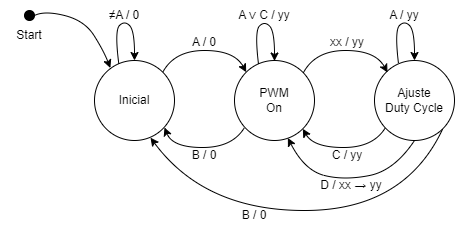
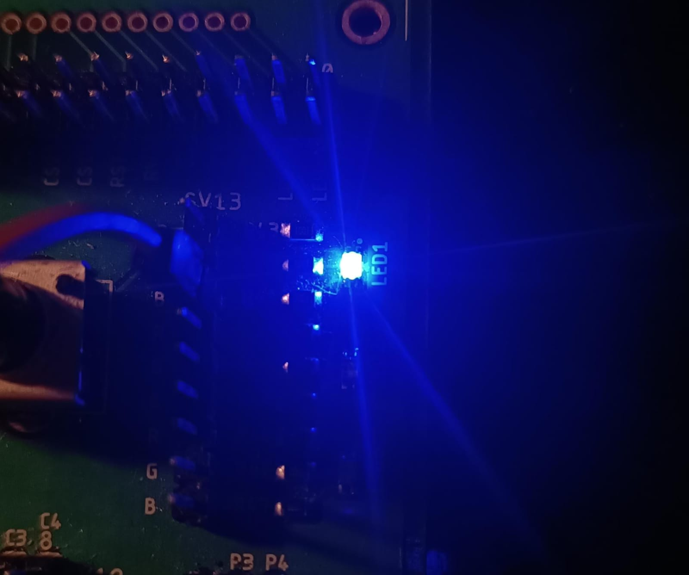

# Proyecto PWM
## Diagrama de estados


***Explicación***: 
En el estado _Inicial_, la máquina está a la espera de ser encendida mediante la tecla **A** y se queda en el mismo estado con cualquier otra entrada. 

Luego, en el estado _PWM on_, el PWM está activo y se puede variar la intensidad del LED ingresando un número con dos cifras que se representa con la entrada **xx**. **A** y **C** no tienen efecto en este estado y si se presionan el duty cycle continúa con el valor guardado **yy**. Con la entrada **B**, se apaga el PWM y vuelve al estado inicial. Y con la entrada del número **xx**, cambia al siguiente estado y provisionalmente la salida sigue en **yy**.

En el estado _Ajuste Duty Cycle_, con la entrada **C** se cancela el cambio de duty cycle y se regresa al estado anterior manteniendo el valor de duty cycle guardado **yy**. Si se presiona en cambio la **D**, el valor de **xx** se convierte en **yy** a partir de ese momento y por ende el duty cycle queda guardado, también regresa al estado anterior que es el de operación normal. En el diagrama este proceso se representa como: (**xx -> yy**). Con la entrada **A** no pasa nada, sigue esperando cancelación o guardado. Finalmente, si en este estado se presiona **B**, se apaga el PWM y vuelve al estado inicial.

## Control de PWM con un LED

Se implementó el ejemplo *"Led Blinky"* del SDK y se modificó para que con un Duty Cycle dado, entregue la señal PWM a un led.

Los cambios se hicieron sobre el archivo *led_blinky.c* sobre la función principal:

```c
int main(void)
{
    /* Board pin init */
    BOARD_InitPins();
    BOARD_InitBootClocks();

    /* Set systick reload value to generate 10 us interrupt */
    if (SysTick_Config(SystemCoreClock / 100000U))
    {
        while (1)
        {
        }
    }

    while (1)
    {
    	int DutyCycle = 1; // De 0 a 99
    	int Dmax = 100U; // Periodo máximo con D = 100%

    	SysTick_DelayTicks((Dmax * DutyCycle) / 100); // Tiempo encendido
        GPIO_PortToggle(BOARD_LED_GPIO, 1u << BOARD_LED_GPIO_PIN);
        SysTick_DelayTicks(Dmax - (Dmax * DutyCycle) / 100); // Tiempo apagado
        GPIO_PortToggle(BOARD_LED_GPIO, 1u << BOARD_LED_GPIO_PIN);
    }
}
```

- **1)** Se cambió la configuración del SysTick para que genere interrupciones cada 10 us en vez de los 1ms del ejemplo. Esto para que se puedan poner frecuencias más altas en los delays.
- **2)** Se crearon las variables *DutyCycle* y *Dmax* de manera provisional para variar los parámetros de la señal PWM.
- **3)** Se implementa el PWM de la siguiente forma: primero un delay con el tiempo de encendido, luego se apaga el led, luego hay otro delay con el tiempo de apagado y luego se enciende el led.
- **4)** Los tiempos de encendido y apagado se calculan de la siguiente forma:


- **Funcionamiento:**


Con Duty Cycle = 1

Con Duty Cycle = 99
